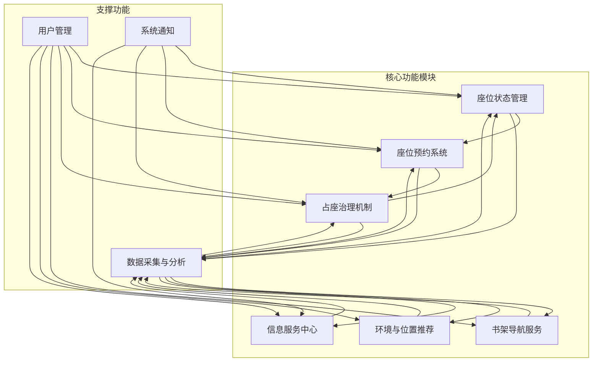
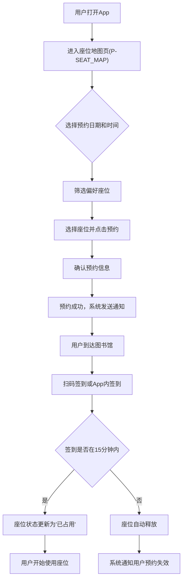
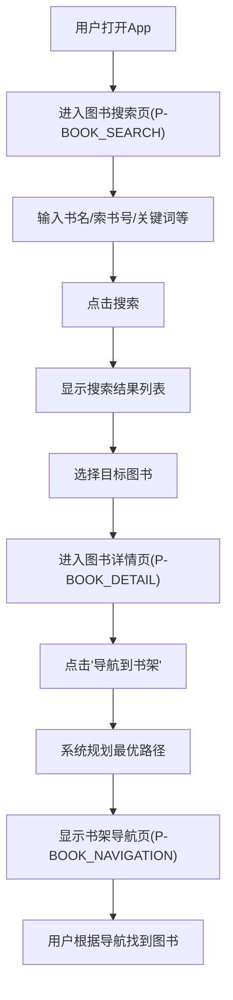
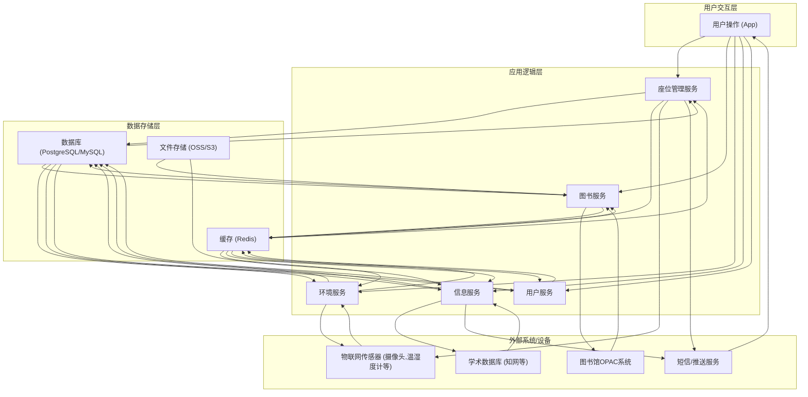

# 图书馆智能助手产品需求文档

## 1. 产品概述

### 1.1 产品名称与定位

*   **产品名称:** 图书馆智能助手
*   **产品定位:** 一款专为图书馆读者设计的移动端智能服务应用，旨在通过整合座位管理、图书导航、环境优化、信息服务及学术辅助等功能，提升读者在图书馆的学习体验和效率。

### 1.2 产品愿景与目标

*   **产品愿景:** 成为图书馆数字化转型的核心工具，构建一个高效、便捷、智能、舒适的现代化图书馆服务生态。
*   **产品目标:**
    *   提升图书馆座位利用率，减少占座现象，优化座位资源分配。
    *   简化图书查找流程，提高图书资源的可发现性和获取效率。
    *   提供个性化的学习环境推荐，提升读者学习舒适度。
    *   实现图书馆能耗的智能管理，促进绿色节能。
    *   提供便捷的信息获取和学术辅助，增强图书馆的服务价值。
    *   建立有效的占座治理机制，维护公平的学习秩序。

### 1.3 产品使用终端

*   **主要终端:** 移动端App (支持iOS和Android操作系统)

### 1.4 核心价值主张

*   **高效便捷:** 一站式解决座位预约、图书查找、信息获取等需求，节省读者时间。
*   **智能个性化:** 基于用户偏好和实时数据，提供定制化的座位推荐和学习环境建议。
*   **公平有序:** 通过智能占座治理，保障每位读者公平使用图书馆资源的权利。
*   **绿色节能:** 利用智能能耗管理，助力图书馆实现可持续发展目标。
*   **学术赋能:** 整合学术资源，为读者提供便捷的学术研究支持。

### 1.5 目标用户群体分析

*   **主要用户:**
    *   **在校学生:** 对图书馆座位资源有高频需求，注重学习效率和环境舒适度，需要便捷的图书查找和学术辅助功能。
    *   **教师及研究人员:** 需要高效获取学术资源，可能对研修间等特定区域有预约需求，关注图书馆的学术活动和培训。
*   **次要用户:**
    *   **图书馆管理员:** 需要通过系统进行座位管理、占座治理、能耗监控和活动发布，提升管理效率。
    *   **普通市民/社会读者:** 对公共图书馆资源有使用需求，需要基础的座位查询和图书导航功能。

### 1.6 市场需求与竞品简析

*   **市场需求:**
    *   随着数字化转型的深入，传统图书馆服务模式已无法满足现代读者对便捷性、个性化和智能化的需求。
    *   座位紧张和占座问题是高校及公共图书馆普遍面临的痛点，亟需有效的解决方案。
    *   读者对高效获取信息、精准查找图书以及舒适学习环境的需求日益增长。
    *   图书馆在节能降耗、提升服务质量方面也面临着压力和挑战。
*   **竞品简析:**
    *   **传统图书馆管理系统:** 通常功能单一，缺乏移动端应用和智能分析能力，用户体验不佳。
    *   **部分高校/图书馆自研App:** 功能可能覆盖部分需求，但往往在用户体验、智能推荐、跨系统整合方面存在不足。
    *   **第三方座位预约工具:** 专注于座位预约，但缺乏与图书馆其他服务的深度整合。
*   **本产品优势:** 本产品通过整合多维度智能服务，提供一站式解决方案，尤其在智能推荐、环境优化和学术辅助方面形成差异化竞争优势，旨在全面提升用户体验和图书馆管理效率。

## 2. 功能规格

### 2.1 功能详述

#### 2.1.1 座位状态管理

| 功能ID | 功能名称 | 功能描述 | 优先级 |
|--------|---------|---------|--------|
| F-SEAT_STATUS_001 | 实时座位地图 | 通过红黄绿颜色标识显示图书馆各区域座位占用状态（红色：已占用，黄色：临时离开，绿色：空闲）。地图需支持缩放和拖动，清晰展示座位布局。 | P0 |
| F-SEAT_STATUS_002 | 座位状态检测 | 通过读者扫码打卡或物联网传感器（摄像头数据实时截图、OCR人形或书本识别）技术，实时识别座位使用情况并更新状态。 | P0 |
| F-SEAT_STATUS_003 | 座位偏好筛选 | 支持读者按靠窗、有电源、安静区、讨论区、光照条件（阳光/阴凉）等偏好筛选座位，并在地图上高亮显示符合条件的座位。 | P0 |

#### 2.1.2 座位预约系统

| 功能ID | 功能名称 | 功能描述 | 优先级 |
|--------|---------|---------|--------|
| F-SEAT_BOOKING_001 | 座位预约 | 支持读者提前预约特定座位或区域（如研修间、静音区），可选择预约日期和时间段。 | P0 |
| F-SEAT_BOOKING_002 | 签到管理 | 预约成功后，读者需在预约开始时间后15分钟内到场扫码确认签到，超时未签到系统自动释放座位。 | P0 |
| F-SEAT_BOOKING_003 | 临时离开 | 提供扫码或APP按钮锁定座位功能，锁定时长为30分钟。超时未归，系统自动释放座位。 | P0 |

#### 2.1.3 占座治理机制

| 功能ID | 功能名称 | 功能描述 | 优先级 |
|--------|---------|---------|--------|
| F-SEAT_GOVERNANCE_001 | 占座举报 | 允许读者通过App举报违规占座行为（如长时间无人但物品占位），需上传照片或描述。 | P0 |
| F-SEAT_GOVERNANCE_002 | 系统提醒 | 对违规占座行为，系统自动向违规读者发送提醒通知。 | P0 |
| F-SEAT_GOVERNANCE_003 | 座位释放 | 超时未归座位自动释放，并通过App通知下一位等待者或系统管理员。 | P0 |

#### 2.1.4 书架导航服务

| 功能ID | 功能名称 | 功能描述 | 优先级 |
|--------|---------|---------|--------|
| F-BOOK_NAV_001 | 图书定位 | 读者输入书名或索书号，系统规划从当前位置到目标书架的最优路径，并在App内显示导航指引。 | P0 |
| F-BOOK_NAV_002 | 精准导航 | 导航至具体书架的层架位置，提供清晰的指引信息。 | P0 |
| F-BOOK_NAV_003 | 多维度搜索 | 支持通过主题、关键词、作者、ISBN或模糊描述（如“关于AI伦理的入门书”）搜索图书，并显示图书的详细信息及可借阅状态。 | P0 |

#### 2.1.5 环境与位置推荐

| 功能ID | 功能名称 | 功能描述 | 优先级 |
|--------|---------|---------|--------|
| F-ENV_RECOMMEND_001 | 环境监测 | 实时监测图书馆各区域人流量、噪音分贝、光照和温湿度数据。 | P0 |
| F-ENV_RECOMMEND_002 | 最优位置推荐 | 基于环境监测数据和用户偏好，自动推荐更舒适、更符合需求的学习区域。 | P0 |
| F-ENV_RECOMMEND_003 | 能耗管理 | 基于人流数据和环境监测结果，智能调节图书馆空调、灯光等设备，实现绿色节能。 | P1 |
| F-ENV_RECOMMEND_004 | 设备监控 | 监控图书馆内空调、灯光等设备的运行状态，支持远程控制和故障报警。 | P1 |
| F-ENV_RECOMMEND_005 | 环境智能调节 | 根据环境数据和能耗管理策略，自动调节图书馆内的温度、湿度、光照等环境参数。 | P1 |

#### 2.1.6 信息服务中心

| 功能ID | 功能名称 | 功能描述 | 优先级 |
|--------|---------|---------|--------|
| F-INFO_SERVICE_001 | 智能问答 | 提供7x24小时智能问答机器人，回答图书馆常见问题（如图书馆开放时间、借阅规则、活动信息等）。 | P0 |
| F-INFO_SERVICE_002 | 公告系统 | 发布图书馆开放时间、闭馆通知、政策调整等重要公告，并支持推送通知。 | P0 |
| F-INFO_SERVICE_003 | 活动管理 | 发布并推荐图书馆举办的讲座、培训、展览等活动，支持在线报名和活动详情查看。 | P0 |
| F-INFO_SERVICE_004 | 书目优化 | 分析热门书籍借阅率、预约率等数据，为图书馆采购新书提供数据支持和建议。 | P1 |
| F-INFO_SERVICE_005 | 学术助手 | 与知网等学术数据库联动，帮助读者追踪研究前沿，推荐相关文献。 | P1 |

### 2.2 功能模块间的关系图

## 3. 用户流程

### 3.1 用户旅程地图

| 阶段 | 用户目标 | 用户行为 | 系统响应 | 痛点/机遇 | 情绪 |
|------|----------|----------|----------|-----------|------|
| **进入图书馆前** | 了解座位情况，预约座位 | 打开App，查看实时座位地图，筛选偏好座位，进行预约 | 显示实时座位状态，提供预约选项，发送预约成功通知 | 座位紧张，预约流程复杂 | 期待 -> 满意 |
| **进入图书馆后** | 找到预约座位，或寻找合适座位 | 扫码签到，或根据App推荐寻找座位 | 确认签到，更新座位状态，提供导航指引 | 找不到座位，占座现象 | 焦虑 -> 安心 |
| **学习过程中** | 临时离开，防止座位被占 | 点击临时离开按钮，或扫码锁定座位 | 锁定座位，开始计时，超时提醒 | 座位被他人占用 | 担忧 -> 放心 |
| **需要图书时** | 查找特定图书，快速定位 | 在App中搜索图书，获取索书号，使用书架导航 | 显示图书信息，规划导航路径，提供精准指引 | 图书难找，书架复杂 | 困惑 -> 高效 |
| **环境不适时** | 寻找更舒适的学习区域 | 查看环境监测数据，接收最优位置推荐 | 显示各区域环境数据，推荐合适区域 | 噪音大，温度不适 | 烦躁 -> 舒适 |
| **获取信息时** | 了解图书馆公告，参与活动 | 浏览公告，查看活动列表，在线报名 | 展示最新公告，提供活动详情和报名入口 | 信息滞后，错过活动 | 茫然 -> 及时 |
| **遇到问题时** | 寻求帮助，解答疑问 | 咨询智能客服，或提交问题反馈 | 智能问答，提供解决方案，或转人工处理 | 问题无法及时解决 | 无助 -> 解决 |

### 3.2 关键路径流程图

#### 3.2.1 座位预约与签到流程

#### 3.2.2 图书查找与导航流程

### 3.3 各场景下的用户操作步骤

#### 3.3.1 场景一：预约并使用座位

1.  **用户操作:** 打开图书馆智能助手App。
2.  **用户操作:** 点击底部导航栏“座位”图标，进入座位地图页（P-SEAT_MAP）。
3.  **用户操作:** 在座位地图页（P-SEAT_MAP）选择预约日期和时间段。
4.  **用户操作:** 点击筛选按钮，选择“靠窗”、“有电源”等偏好，地图上高亮显示符合条件的座位。
5.  **用户操作:** 点击一个绿色空闲座位，弹出座位详情和预约按钮。
6.  **用户操作:** 点击“预约”按钮，进入预约确认页（P-BOOKING_CONFIRM）。
7.  **用户操作:** 确认预约信息无误后，点击“确认预约”按钮。
8.  **系统响应:** 预约成功，App显示预约成功提示，并发送预约成功通知到用户手机。
9.  **用户操作:** 用户到达图书馆，在预约座位旁的二维码或App内点击“签到”按钮。
10. **系统响应:** 系统验证签到时间是否在预约开始后15分钟内。
11. **系统响应:** 若签到成功，座位状态更新为“已占用”，用户可开始使用座位。
12. **系统响应:** 若签到超时，系统自动释放座位，并发送预约失效通知。

#### 3.3.2 场景二：临时离开座位

1.  **用户操作:** 在座位使用过程中，需要临时离开。
2.  **用户操作:** 打开App，进入我的预约页（P-MY_BOOKINGS），找到当前使用的座位。
3.  **用户操作:** 点击“临时离开”按钮。
4.  **系统响应:** 座位状态更新为“临时离开”，开始30分钟倒计时。
5.  **用户操作:** 用户在30分钟内返回座位。
6.  **用户操作:** 点击“返回座位”按钮或再次扫码。
7.  **系统响应:** 座位状态恢复为“已占用”，倒计时停止。
8.  **系统响应:** 若用户超时未返回，系统自动释放座位，并通知下一位等待者或管理员。

#### 3.3.3 场景三：查找并导航到图书

1.  **用户操作:** 打开图书馆智能助手App。
2.  **用户操作:** 点击底部导航栏“图书”图标，进入图书搜索页（P-BOOK_SEARCH）。
3.  **用户操作:** 在搜索框中输入书名、作者、关键词或模糊描述（如“关于AI伦理的入门书”）。
4.  **用户操作:** 点击搜索按钮。
5.  **系统响应:** 显示搜索结果列表，包含图书封面、书名、作者、索书号、可借阅状态等信息。
6.  **用户操作:** 点击列表中感兴趣的图书，进入图书详情页（P-BOOK_DETAIL）。
7.  **用户操作:** 在图书详情页（P-BOOK_DETAIL）点击“导航到书架”按钮。
8.  **系统响应:** 系统规划从用户当前位置到目标书架的最优路径，并显示书架导航页（P-BOOK_NAVIGATION）。
9.  **用户操作:** 根据App内的导航指引，找到目标书架和层架。

## 4. 数据流设计

### 4.1 数据结构与关系

*   **用户 (User):**
    *   `UserID` (PK)
    *   `Username`
    *   `PasswordHash`
    *   `Email`
    *   `PhoneNumber`
    *   `RegistrationDate`
    *   `LastLoginDate`
    *   `Preferences` (JSONB, 存储用户座位偏好、通知设置等)
*   **座位 (Seat):**
    *   `SeatID` (PK)
    *   `SeatNumber`
    *   `ZoneID` (FK to Zone)
    *   `LocationDescription` (如：A区-靠窗-有电源)
    *   `Status` (空闲/已占用/临时离开/已预约)
    *   `IsWindowSide` (布尔)
    *   `HasPowerOutlet` (布尔)
    *   `IsQuietZone` (布尔)
    *   `IsDiscussionZone` (布尔)
    *   `LightingCondition` (阳光/阴凉)
*   **区域 (Zone):**
    *   `ZoneID` (PK)
    *   `ZoneName` (如：一层阅览区、研修间、静音区)
    *   `Floor`
    *   `Capacity`
*   **预约 (Booking):**
    *   `BookingID` (PK)
    *   `UserID` (FK to User)
    *   `SeatID` (FK to Seat)
    *   `StartTime`
    *   `EndTime`
    *   `BookingTime`
    *   `Status` (待签到/已签到/已完成/已取消/已释放)
    *   `CheckInTime`
    *   `CheckOutTime`
*   **临时离开 (TemporaryLeave):**
    *   `LeaveID` (PK)
    *   `BookingID` (FK to Booking)
    *   `LeaveStartTime`
    *   `LeaveEndTime` (LeaveStartTime + 30分钟)
    *   `Status` (进行中/已返回/已超时)
*   **举报 (Report):**
    *   `ReportID` (PK)
    *   `ReporterUserID` (FK to User)
    *   `SeatID` (FK to Seat)
    *   `ReportTime`
    *   `ReportType` (占座/设备故障/环境问题)
    *   `Description`
    *   `ImageURL`
    *   `Status` (待处理/已处理/已驳回)
    *   `HandlerUserID` (FK to User, 管理员)
    *   `HandleTime`
*   **图书 (Book):**
    *   `BookID` (PK)
    *   `Title`
    *   `Author`
    *   `ISBN`
    *   `Publisher`
    *   `PublicationYear`
    *   `Subject`
    *   `Keywords`
    *   `Description`
    *   `CoverImageURL`
    *   `TotalCopies`
    *   `AvailableCopies`
    *   `ShelfLocation` (索书号)
*   **图书副本 (BookCopy):**
    *   `CopyID` (PK)
    *   `BookID` (FK to Book)
    *   `Status` (可借阅/已借出/在馆/损坏/丢失)
    *   `BorrowerUserID` (FK to User, 可为空)
    *   `BorrowDate`
    *   `DueDate`
*   **环境数据 (EnvironmentData):**
    *   `DataID` (PK)
    *   `ZoneID` (FK to Zone)
    *   `Timestamp`
    *   `Temperature`
    *   `Humidity`
    *   `NoiseLevel`
    *   `LightIntensity`
    *   `OccupancyCount`
*   **公告 (Announcement):**
    *   `AnnouncementID` (PK)
    *   `Title`
    *   `Content`
    *   `PublishTime`
    *   `PublisherUserID` (FK to User, 管理员)
    *   `IsPinned` (布尔)
*   **活动 (Event):**
    *   `EventID` (PK)
    *   `Title`
    *   `Description`
    *   `StartTime`
    *   `EndTime`
    *   `Location`
    *   `Capacity`
    *   `RegisteredCount`
    *   `PublishTime`
    *   `PublisherUserID` (FK to User, 管理员)
*   **活动报名 (EventRegistration):**
    *   `RegistrationID` (PK)
    *   `EventID` (FK to Event)
    *   `UserID` (FK to User)
    *   `RegistrationTime`
    *   `Status` (已报名/已取消)

### 4.2 关键数据流向图

### 4.3 数据存储与处理原则

1.  **数据安全性:**
    *   所有用户敏感数据（如密码）进行加密存储。
    *   数据传输采用HTTPS加密协议。
    *   定期进行数据备份和灾难恢复演练。
    *   严格的访问控制和权限管理，确保只有授权人员和系统能访问数据。
2.  **数据实时性:**
    *   座位状态、环境监测数据等关键信息需保证实时更新，通过传感器直连或高频数据同步机制实现。
    *   缓存机制（如Redis）用于加速热点数据读取，提升用户体验。
3.  **数据一致性:**
    *   采用事务管理确保多步操作的数据原子性，避免数据不一致。
    *   座位预约和释放逻辑需保证强一致性，防止超售或错售。
4.  **数据可扩展性:**
    *   数据库设计采用范式化原则，便于未来功能扩展和数据量增长。
    *   考虑使用分布式数据库或读写分离方案应对高并发和大数据量。
5.  **数据隐私保护:**
    *   严格遵守相关数据隐私法规（如GDPR、国内网络安全法）。
    *   匿名化或去标识化处理用户行为数据，用于统计分析和推荐算法。
6.  **数据可追溯性:**
    *   关键操作（如预约、签到、举报）需记录操作日志，便于问题排查和审计。

## 5. 页面规格

### 5.1 页面概览

| 页面ID | 页面名称 | 核心功能 |
|--------|---------|---------|
| P-HOME | 首页 | 快速入口、推荐信息、公告概览 |
| P-SEAT_MAP | 座位地图页 | 实时座位状态、座位筛选、预约入口 |
| P-BOOKING_CONFIRM | 预约确认页 | 确认预约信息、提交预约 |
| P-MY_BOOKINGS | 我的预约页 | 查看和管理我的预约、临时离开操作 |
| P-REPORT_SEAT | 举报占座页 | 提交占座举报信息 |
| P-BOOK_SEARCH | 图书搜索页 | 多维度图书搜索 |
| P-BOOK_DETAIL | 图书详情页 | 图书详细信息、导航入口 |
| P-BOOK_NAVIGATION | 书架导航页 | 图书导航路径展示 |
| P-ENVIRONMENT | 环境监测页 | 各区域环境数据展示 |
| P-RECOMMENDATION | 最优位置推荐页 | 基于环境数据的位置推荐 |
| P-ANNOUNCEMENT_LIST | 公告列表页 | 图书馆公告列表 |
| P-ANNOUNCEMENT_DETAIL | 公告详情页 | 公告详细内容 |
| P-EVENT_LIST | 活动列表页 | 图书馆活动列表、报名入口 |
| P-EVENT_DETAIL | 活动详情页 | 活动详细内容、报名操作 |
| P-INTELLECTUAL_QNA | 智能问答页 | 智能客服对话界面 |
| P-USER_PROFILE | 个人中心页 | 用户信息、设置入口、我的活动 |
| P-SETTINGS | 设置页 | 应用通用设置、通知设置 |
| P-NOTIFICATION_SETTINGS | 通知设置页 | 管理App通知偏好 |
| P-ABOUT_US | 关于我们页 | 应用版本信息、隐私政策等 |

### 5.2 页面详情

#### 5.2.1 首页（P-HOME）

*   **页面名称与目的:** 首页，作为用户进入App后的主要入口，提供核心功能的快捷访问、个性化推荐信息和最新公告概览。
*   **页面负责的核心功能:**
    *   展示图书馆实时座位概览。
    *   提供座位预约、图书搜索、书架导航、智能问答等核心功能的快捷入口。
    *   展示最新公告和推荐活动。
    *   显示用户当前预约状态（如有）。
*   **主要UI元素与布局建议:**
    *   顶部：搜索框（可搜索图书、活动、公告），消息通知图标。
    *   中部：
        *   轮播图：展示最新公告或热门活动。
        *   快捷功能区：图标+文字形式，包含“座位预约”、“图书搜索”、“书架导航”、“智能问答”等。
        *   我的预约卡片：显示当前有效的预约信息，点击可进入我的预约页（P-MY_BOOKINGS）。
        *   推荐内容区：如“最优位置推荐”、“热门图书”、“即将开始的活动”等。
    *   底部：固定导航栏，包含“首页”、“座位”、“图书”、“我的”等。
*   **页面需展示的关键数据:**
    *   图书馆总座位数、空闲座位数。
    *   用户当前有效的座位预约信息（座位号、时间）。
    *   最新公告标题和发布时间。
    *   推荐活动标题、时间和地点。

#### 5.2.2 座位地图页（P-SEAT_MAP）

*   **页面名称与目的:** 座位地图页，用于展示图书馆各区域座位的实时占用状态，并提供座位筛选和预约功能。
*   **页面负责的核心功能:**
    *   显示图书馆楼层和区域选择。
    *   以红黄绿颜色标识座位状态。
    *   提供座位偏好筛选功能。
    *   支持座位点击查看详情和预约。
*   **主要UI元素与布局建议:**
    *   顶部：楼层选择器（下拉菜单或Tab切换），区域选择器，筛选按钮。
    *   中部：可缩放、拖动的图书馆座位平面图，座位以不同颜色显示状态。
    *   底部：当前楼层/区域座位总数、空闲数、已占用数、临时离开数统计。
*   **页面需展示的关键数据:**
    *   各楼层、各区域的座位布局图。
    *   每个座位的实时状态（空闲、已占用、临时离开、已预约）。
    *   筛选条件（靠窗、电源、安静区、讨论区、光照）。

#### 5.2.3 预约确认页（P-BOOKING_CONFIRM）

*   **页面名称与目的:** 预约确认页，用于用户在选择座位后，确认预约的详细信息并提交预约。
*   **页面负责的核心功能:**
    *   展示所选座位的详细信息。
    *   展示预约的日期和时间段。
    *   提供确认预约和取消预约的操作。
*   **主要UI元素与布局建议:**
    *   顶部：返回按钮，页面标题“确认预约”。
    *   中部：
        *   座位信息：座位号、区域、楼层、偏好标签（如靠窗、有电源）。
        *   预约时间：预约日期、开始时间、结束时间。
        *   预约规则提示：如“请在预约开始后15分钟内签到，超时自动释放”。
    *   底部：固定“确认预约”按钮。
*   **页面需展示的关键数据:**
    *   座位ID、座位号、区域、楼层、偏好标签。
    *   预约开始时间、结束时间。

#### 5.2.4 我的预约页（P-MY_BOOKINGS）

*   **页面名称与目的:** 我的预约页，用于用户查看和管理自己的座位预约记录。
*   **页面负责的核心功能:**
    *   展示当前有效的预约。
    *   展示历史预约记录。
    *   提供临时离开、取消预约、扫码签到等操作。
*   **主要UI元素与布局建议:**
    *   顶部：返回按钮，页面标题“我的预约”。
    *   中部：
        *   “当前预约”区域：显示正在进行或即将开始的预约，包含座位号、时间、状态，并提供“临时离开”、“取消预约”、“扫码签到”按钮。
        *   “历史预约”区域：列表形式展示已完成或已取消的预约，可按时间排序。
*   **页面需展示的关键数据:**
    *   当前预约的座位ID、座位号、区域、开始时间、结束时间、状态。
    *   历史预约的座位ID、座位号、区域、开始时间、结束时间、状态。

#### 5.2.5 举报占座页（P-REPORT_SEAT）

*   **页面名称与目的:** 举报占座页，用于用户提交违规占座行为的举报。
*   **页面负责的核心功能:**
    *   允许用户选择被举报的座位。
    *   提供举报类型选择。
    *   支持上传图片和文字描述。
    *   提交举报。
*   **主要UI元素与布局建议:**
    *   顶部：返回按钮，页面标题“举报占座”。
    *   中部：
        *   座位选择器：可通过地图选择或手动输入座位号。
        *   举报类型选择：单选框或下拉菜单（如：长时间无人、物品占位）。
        *   描述输入框：多行文本输入。
        *   图片上传区域：支持拍照或从相册选择图片。
    *   底部：固定“提交举报”按钮。
*   **页面需展示的关键数据:**
    *   被举报座位的座位号。
    *   举报类型选项。
    *   用户输入的描述。
    *   上传的图片预览。

#### 5.2.6 图书搜索页（P-BOOK_SEARCH）

*   **页面名称与目的:** 图书搜索页，用于用户通过多种维度搜索图书馆藏书。
*   **页面负责的核心功能:**
    *   提供搜索框，支持书名、作者、关键词、ISBN、索书号、模糊描述搜索。
    *   显示搜索结果列表。
    *   支持搜索历史和热门搜索词。
*   **主要UI元素与布局建议:**
    *   顶部：搜索框，搜索按钮，取消按钮。
    *   中部：
        *   搜索历史列表。
        *   热门搜索词标签云。
        *   搜索结果列表：每项包含图书封面、书名、作者、索书号、可借阅状态。
*   **页面需展示的关键数据:**
    *   搜索历史记录。
    *   热门搜索词。
    *   图书搜索结果列表（BookID, Title, Author, ISBN, CoverImageURL, AvailableCopies）。

#### 5.2.7 图书详情页（P-BOOK_DETAIL）

*   **页面名称与目的:** 图书详情页，用于展示图书的详细信息，并提供书架导航入口。
*   **页面负责的核心功能:**
    *   展示图书的基本信息（封面、书名、作者、出版社、ISBN、简介等）。
    *   显示图书的可借阅状态和副本信息。
    *   提供“导航到书架”按钮。
*   **主要UI元素与布局建议:**
    *   顶部：返回按钮，页面标题“图书详情”。
    *   中部：
        *   图书封面图。
        *   图书基本信息：书名、作者、出版社、出版年份、ISBN、索书号。
        *   图书简介。
        *   可借阅状态：显示可借阅副本数量。
        *   “导航到书架”按钮。
*   **页面需展示的关键数据:**
    *   BookID, Title, Author, Publisher, PublicationYear, ISBN, Subject, Keywords, Description, CoverImageURL, TotalCopies, AvailableCopies, ShelfLocation。

#### 5.2.8 书架导航页（P-BOOK_NAVIGATION）

*   **页面名称与目的:** 书架导航页，用于为用户提供从当前位置到目标图书所在书架的最优路径指引。
*   **页面负责的核心功能:**
    *   显示图书馆平面图。
    *   绘制从用户当前位置到目标书架的导航路径。
    *   提供语音或文字导航提示。
*   **主要UI元素与布局建议:**
    *   顶部：返回按钮，页面标题“书架导航”。
    *   中部：可缩放、拖动的图书馆平面图，显示用户当前位置、目标书架位置和导航路径。
    *   底部：导航提示信息（如“向前走5米，左转”），或语音播放按钮。
*   **页面需展示的关键数据:**
    *   图书馆平面图。
    *   用户当前位置坐标。
    *   目标书架坐标。
    *   规划的导航路径点。

#### 5.2.9 环境监测页（P-ENVIRONMENT）

*   **页面名称与目的:** 环境监测页，用于展示图书馆各区域的实时环境数据。
*   **页面负责的核心功能:**
    *   显示各区域的人流量、噪音分贝、光照和温湿度数据。
    *   支持按区域或指标筛选查看。
*   **主要UI元素与布局建议:**
    *   顶部：返回按钮，页面标题“环境监测”。
    *   中部：
        *   区域选择器（下拉菜单或Tab切换）。
        *   环境指标图表或仪表盘：显示人流量、噪音、光照、温湿度的实时数值和趋势图。
        *   各区域环境数据列表。
*   **页面需展示的关键数据:**
    *   各区域的实时Temperature, Humidity, NoiseLevel, LightIntensity, OccupancyCount。
    *   数据更新时间戳。

#### 5.2.10 最优位置推荐页（P-RECOMMENDATION）

*   **页面名称与目的:** 最优位置推荐页，基于环境监测数据和用户偏好，向用户推荐更舒适的学习区域。
*   **页面负责的核心功能:**
    *   展示推荐的学习区域列表。
    *   显示每个推荐区域的环境优势。
    *   提供前往该区域的导航入口。
*   **主要UI元素与布局建议:**
    *   顶部：返回按钮，页面标题“最优位置推荐”。
    *   中部：
        *   推荐区域列表：每项包含区域名称、推荐理由（如“安静、温度适宜”）、当前环境数据摘要。
        *   “查看环境数据”按钮，可跳转到环境监测页（P-ENVIRONMENT）。
*   **页面需展示的关键数据:**
    *   推荐区域的ZoneID, ZoneName。
    *   推荐理由（基于Temperature, Humidity, NoiseLevel, LightIntensity, OccupancyCount）。
    *   各推荐区域的实时环境数据摘要。

#### 5.2.11 公告列表页（P-ANNOUNCEMENT_LIST）

*   **页面名称与目的:** 公告列表页，用于展示图书馆发布的所有公告。
*   **页面负责的核心功能:**
    *   显示公告标题、发布时间。
    *   支持公告搜索和筛选。
*   **主要UI元素与布局建议:**
    *   顶部：返回按钮，页面标题“公告”，搜索框。
    *   中部：公告列表，每项包含公告标题、发布时间。
*   **页面需展示的关键数据:**
    *   AnnouncementID, Title, PublishTime。

#### 5.2.12 公告详情页（P-ANNOUNCEMENT_DETAIL）

*   **页面名称与目的:** 公告详情页，用于展示单条公告的完整内容。
*   **页面负责的核心功能:**
    *   显示公告标题、发布时间、发布者、详细内容。
*   **主要UI元素与布局建议:**
    *   顶部：返回按钮，页面标题“公告详情”。
    *   中部：公告标题、发布时间、发布者、公告正文。
*   **页面需展示的关键数据:**
    *   AnnouncementID, Title, Content, PublishTime, PublisherUserID。

#### 5.2.13 活动列表页（P-EVENT_LIST）

*   **页面名称与目的:** 活动列表页，用于展示图书馆举办的各类讲座、培训等活动。
*   **页面负责的核心功能:**
    *   显示活动标题、时间、地点、状态（报名中/已结束）。
    *   支持活动搜索和筛选。
*   **主要UI元素与布局建议:**
    *   顶部：返回按钮，页面标题“活动”，搜索框。
    *   中部：活动列表，每项包含活动标题、时间、地点、报名状态。
*   **页面需展示的关键数据:**
    *   EventID, Title, StartTime, EndTime, Location, Status (报名中/已结束), RegisteredCount, Capacity。

#### 5.2.14 活动详情页（P-EVENT_DETAIL）

*   **页面名称与目的:** 活动详情页，用于展示单条活动的完整内容，并提供在线报名功能。
*   **页面负责的核心功能:**
    *   显示活动标题、时间、地点、详细描述、主讲人等。
    *   显示当前报名人数和总容量。
    *   提供“立即报名”或“取消报名”按钮。
*   **主要UI元素与布局建议:**
    *   顶部：返回按钮，页面标题“活动详情”。
    *   中部：活动标题、时间、地点、主讲人、活动简介、报名状态（已报名/未报名）、报名人数/总容量。
    *   底部：固定“立即报名”或“取消报名”按钮。
*   **页面需展示的关键数据:**
    *   EventID, Title, Description, StartTime, EndTime, Location, Capacity, RegisteredCount, PublisherUserID。
    *   用户是否已报名该活动。

#### 5.2.15 智能问答页（P-INTELLECTUAL_QNA）

*   **页面名称与目的:** 智能问答页，提供7x24小时智能客服，回答图书馆常见问题。
*   **页面负责的核心功能:**
    *   提供聊天界面，用户可输入问题。
    *   智能客服自动回复。
    *   支持常见问题（FAQ）列表。
*   **主要UI元素与布局建议:**
    *   顶部：返回按钮，页面标题“智能问答”。
    *   中部：聊天消息列表，显示用户提问和智能客服回复。
    *   底部：输入框，发送按钮，常见问题入口。
*   **页面需展示的关键数据:**
    *   聊天记录。
    *   常见问题列表。

#### 5.2.16 个人中心页（P-USER_PROFILE）

*   **页面名称与目的:** 个人中心页，用于展示用户个人信息，并提供设置、我的活动等入口。
*   **页面负责的核心功能:**
    *   显示用户头像、昵称、学号/工号。
    *   提供“我的活动”、“设置”等入口。
*   **主要UI元素与布局建议:**
    *   顶部：用户头像、昵称、学号/工号。
    *   中部：功能列表，如“我的活动”、“设置”、“关于我们”。
*   **页面需展示的关键数据:**
    *   用户头像、昵称、学号/工号。

#### 5.2.17 设置页（P-SETTINGS）

*   **页面名称与目的:** 设置页，用于管理应用的通用设置和通知偏好。
*   **页面负责的核心功能:**
    *   提供通知设置入口。
    *   提供清除缓存、隐私政策、用户协议等入口。
*   **主要UI元素与布局建议:**
    *   顶部：返回按钮，页面标题“设置”。
    *   中部：功能列表，如“通知设置”、“清除缓存”、“隐私政策”、“用户协议”。
*   **页面需展示的关键数据:**
    *   无特定数据，主要为功能入口。

#### 5.2.18 通知设置页（P-NOTIFICATION_SETTINGS）

*   **页面名称与目的:** 通知设置页，用于管理App的通知偏好。
*   **页面负责的核心功能:**
    *   提供总开关控制App通知。
    *   提供细分通知类型的开关（如：预约提醒、活动通知、系统消息）。
*   **主要UI元素与布局建议:**
    *   顶部：返回按钮，页面标题“通知设置”。
    *   中部：
        *   “允许通知”总开关。
        *   细分通知类型列表，每项包含名称和开关。
*   **页面需展示的关键数据:**
    *   各通知类型的当前开启状态。

#### 5.2.19 关于我们页（P-ABOUT_US）

*   **页面名称与目的:** 关于我们页，展示应用的版本信息、版权声明、隐私政策和用户协议等。
*   **页面负责的核心功能:**
    *   显示应用版本号。
    *   提供隐私政策和用户协议的链接。
    *   显示版权信息。
*   **主要UI元素与布局建议:**
    *   顶部：返回按钮，页面标题“关于我们”。
    *   中部：应用Logo、应用名称、版本号、版权声明、隐私政策链接、用户协议链接。
*   **页面需展示的关键数据:**
    *   应用版本号。
    *   版权信息。

